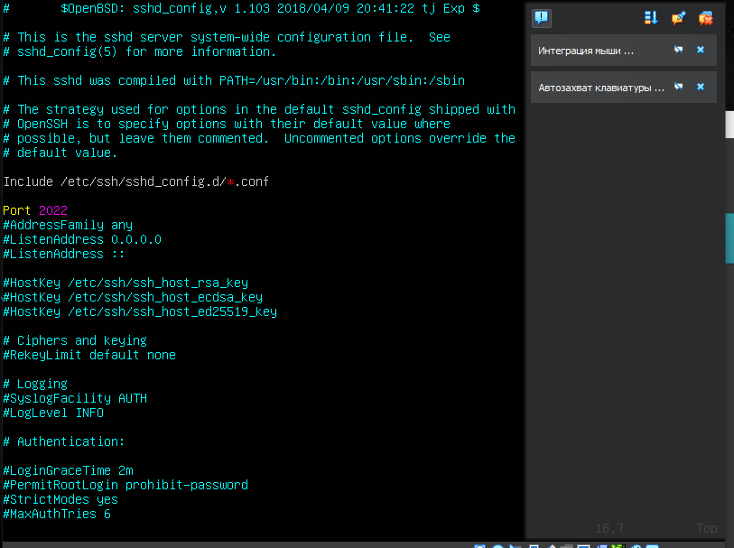
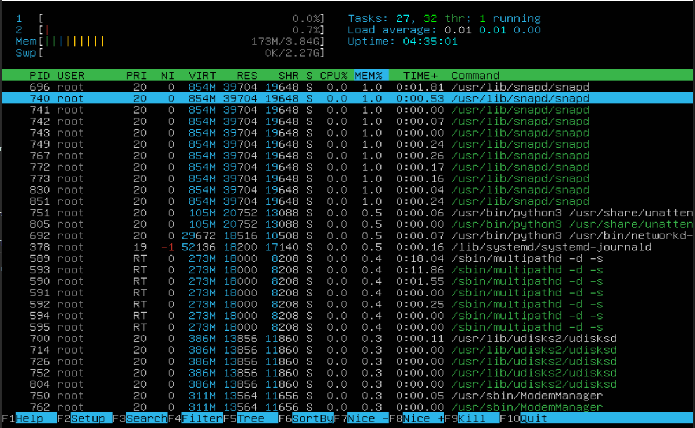

## Part 1. Установка Оперативной Системы

 >**Вывод версии ОС** \
 `cat /etc/issue`
 
## Part 2 Создание ползователя

 >**Команда для создания пользователя и добавления в группу adm** \
 >`sudo adduser Part2 --ingroup adm`

 >**Вывод команды** \
 >`cat /etc/passwd`
 
 ## Part 3 Настройка сети ОС
 
 1. 
  >**Задать название машину вида user-1** \
  >`sudo hostnamectl set-hostname user-1`

 2. 
 >**Установка временной зоны Europe/Moscow** \
 >`sudo timedatectl set-timezone Europe/Moscow`
 
 3. 
 >**Вывести название сетевых интерфейсоф** \
 >`ip link show`
 
 * lo он же loopback device он же local host ip 127.0.0.1 виртуальный интерфейс \
 Используется для отладки сетевых программ изапуска серверных приложений на локально машине

4. 
>**Получить ip Adress машины** \
>`hostname -I`

* DHCP( Dynamic Host Configuration Protocol) прикладной протокол, позволяющий сетевым устройствам получать автоматически IP Adress, Subnet Mask, Standart Gateway, DNS Server от DHCP Server.

5. 
>**Определить и вывести внутрений и внешний IP Adress, он же ip-адрес по умолчание (gw)** \
>Extern `curl ifconfig.me` \
>Intern `ip route`

6. 
>**Статическая конфигурация IP, GW, dns 1.1.1.1 or 8.8.8.8** \
>`sudo vim /etc/netplan/00-installer-config.yaml` \
>**вносим конфигурацию и сохраняеися** \
> `sudo netplan apply`

7.1 
>**Ребут системы и чек конфига** \
>`sudo reboot` \
>`hostname -I`

7.2 
>**Пингуем 1.1.1.1 and ya.ru** \
>`ping 1.1.1.1` \
>`ping ya.ru`
 
## Part 4 Обновление ОС

>**Обновить ОС на последнию версию** \
>`sudo apt-get update` Обновить индекс пакетов \
>`sudo apt-get upgrade` Обновить установленные пакеты

## Part 5 Использование команды sudo

>**Разрешить part2 выполнять sudo** \
>`sudo usermod -aG sudo part2` \
>**Поменять hostname от имени part2 (использую sudo)** \
>`su part2` \
>`sudo hostnamectl set-hostname user-2`

* Команда sudo предоставляет возможность пользователям выполнять команды от имени суперпользователя root, либо других пользователей. Правила, используемые sudo для принятия решения о предоставлении доступа, находятся в файле /etc/sudoers.Имя команды означает substitute user do или super user do. Утилита позволяет запускать программы от имени другого пользователя, но чаще всего от имени корневого.

## Part 6 Установка и настройка служба времени

>**Настроить службу автоматической синхронизации времени** \
>Устанавливаем ntp `sudo apt install ntp` \
>Checkнул синк `timedatectl` \
>Синк ОК `timedatectl show`

## Part 7 Установка и использование текстовых редакторов
**Установить доп редактор** \
>`sudo apt-get installmcedit`

* 7.1 Создать файл test_редактор.txt 3-мя редакторами, вписать ник

VIM 
>`vim test_vim.txt` Пишем ник \
>`:wq` после жмак `Enter`

NANO 
>`nano test_nano.txt` Пишем ник \
>`ctrl` + `x` \
>`Y` \
>`Enter`

MCEDIT 
>`mcedit test_mcedit.txt` Пишем ник \
>`ESC` \
>`Yes` \
>`Enter`

* 7.2 Отредактировать 3-мя редакторами файл на 21 School 21

 VIM 
 >`vim test_vim.txt` стираем и пишем 21 School 21 \
 >`:q!` \
 >`Enter`
 
 NANO 
 >`nano test_nano.txt` стираем и пишем 21 School 21 \
 >`ctrl` + `x`
 >`n`
 
 MCEDIT 
 >`mcedit test_mcedit.txt` стираем и пишем 21 School 21 \
 >`ESC` \
 >`no` \
 >`Enter`
 
 * 7.3 Сделать поиск слова в 3 редакторах
 
 VIM 
 >`vim test_vim.txt` \
 >`/`  пишет что ищем, найденое подсветит
 
 NANO 
 >`nano test_nano.txt` \
 >`ctrl` + `w` \
 >пишем что ищем после жмак `Enter` \
 >Курсор встанет в начало найденого слова и нано подсветить сколько совпадений
 
 MCEDIT 
 >`mcedit test_mcedit.txt` \
 >`F7`  пишем что ищем ё
 >`ok`
 
 * 7.4 find and replace в 3-ёх редакторах
 
 VIM 
 >`vim test_vim.txt` \
 >`:s/deidremi/edu21`
 
 NANO 
 >`nano test_nano.txt` \
 >`ctrl` + `\` пишем что ищем, на что меняем `Enter` \
 >`Y`
 
 MCEDIT 
 >`mcedit test_mcedit.txt` \
 >`F4` пишем что ищем и замену \
 >`ok` \
 >`Replace`
 
 ## Part 8 Установка и базовая настройка сервиса SSHD
 
 * 8.1 Установка службы SSHD \
 `sudo apt-get install openssh-server`
 
 * 8.2 Добавить в Автостарт \
 `sudo systemctl enable ssh`
 
 * 8.3 Сменить порт на 2022 \
 `sudo -i` Логин под супер юзер, иначе не даст править файл \
 `vim /etc/ssh/sshd_config`
  
  
  >правим 15 строку на Port 2022 \
  >`sudo systemctl restart sshd` передёргиваем службу
  
  * 8.4 с помощью службы ps проверить sshd
  
  
  >`ps -aux | grep ssh`
  
  
  * Утилита ps (от англ. Process State — «состояние процессов») — это встроенная программа для Unix-подобных операционных систем. Прежде всего, она широко используется при администрировании ОС семейства GNU / Linux. С ее помощью осуществляется мониторинг активных процессов по виртуальным файлам в файловой системе /proc.  

    Ключи команды `ps`:
    * -A, -e - выбрать все процессы  
    * -a - выбрать все процессы, кроме фоновых  
    * -d - выбрать все процессы, даже фоновые, кроме процессов сессий  
    * -N - выбрать все процессы кроме указанных  
    * -С - выбирать процессы по имени команды  
    * -G - выбрать процессы по ID группы  
    * -p - выбрать процессы PID  
    * --ppid - выбрать процессы по PID родительского процесса  
    * -s - выбрать процессы по ID сессии  
    * -t - выбрать процессы по tty  
    * -u - выбрать процессы пользователя  
    * -x - найти все вхождения строки поиска  

  * Опции форматирования:  

    * -с - отображать информацию планировщика  
    * -f - вывести максимум доступных данных, например, количество потоков  
    * -F - аналогично -f, только выводит ещё больше данных  
    * -l - длинный формат вывода  
    * -j - вывести процессы в стиле Jobs, минимум информации  
    * -M - добавить информацию о безопасности  
    * -o - позволяет определить свой формат вывода  
    * --sort - выполнять сортировку по указанной колонке  
    * -L - отображать потоки процессов в колонках LWP и NLWP  
    * -m - вывести потоки после процесса  
    * -V - вывести информацию о версии  
    * -H - отображать дерево процессов.
    
    
  * 8.5 Reboot OS
  
  
 
  >`sudo reboot` \
  >`sudo apt-get install net-tool` \
  >`netstat -tan`

**Объяснение значения ключей -tan, значения каждого столбца вывода, значения 0.0.0.0:**
    
    * -t - Отображение текущего подключения в состоянии переноса нагрузки с процессора на сетевой адаптер при передаче данных.  
    * -a - Отображение всех подключений и ожидающих портов.  
    * -n - Отображение адресов и номеров портов в числовом формате.  
    * Proto - протокол (tcp, udp, raw), используемый сокетом. TCP/IP — сетевая модель передачи данных, представленных в цифровом виде. Модель описывает способ передачи данных от источника информации к получателю.  
    * Recv-Q - счётчик байт не скопированных программой пользователя из этого сокета.  
    * Send-Q - счётчик байт, не подтверждённых удалённым узлом.  
    * Local Address - адрес и номер порта локального конца сокета.  
    * Foreign Address - адрес и номер порта удалённого конца сокета.  
    * State - Состояние сокета. LISTEN - Сокет ожидает входящих подключений. ESTABLISHED - Сокет находится в состянии установленного подключения.  
    * Адрес 0.0.0.0 означает «любой IP данного компьютера» и включает в себя в том числе 127.0.0.1. Адрес 0.0.0.0 обычно означает, что IP адрес ещё не настроен или не присвоен. Такой адрес указывает хост, который обращается к DHCP для получения IP адреса.

## Part 9 Установка и использование утилит top, htop

**Утилита `top`** 

>`top` \
>Uptime 4 часа 9 минут \  
>Количество Юзеров 1 \
>Общая загрузка системы 0.00 \
>Общее запущеных процесов 104 \
>Загрузка CPU 0%, Юзер процессы 0%, процессы Ядра 0%, Ввод/вывод проц 0%, Обработак программных прерываний 0% \
>Загрузка ОЗУ 171 MiB \
>КЭШ 533.8 MiB \
>PID 1 больше всего памяти \
>PID 1870 болше всего CPU времени

**Утилита `htop`**

Sort by PID 

Sort by PERCENT_CPU 

Sort by PERCENT_MEM 

Sort by TIME 

Filtr by sshd 

Search syslog 

С допами 

## Part 10 Утилита fdisk

>Диск SDA \
>Размер 25 GiB \
>Кол-во секторв 52428800 \
>Swap не создовался

## Part 11 Утилита df

df 
>Размер корнегого раздела 11758760 \
>Размер занятого пространства 5658736 \
>Размер свободного пространства 5480916 \
>Проциент использования 51% \
>Еденица измерения килобайты

df -Th 
>Размер раздела 12 GB \
>Размер занятого пространства 5.4 GB \
>Размер свобоного пространства 5.3 GB \
>Используется 51% \
>Тип файловой системы ext4

## Part 12 Использование Утилиты du

>`du`

>`sudo du -h -d 0 /home /var` Размер папок 

>`sudo du -h -d 0 /var/log`

>`sudo du -h -d 0 /var/log/*` Размер всего содержимого

## Part 13 Утилита ncdu

`sudo apt install ncdu` Устанавливаем утилиту

>`ncdu /home`

>`ncdu /var` 

>`ncdu /var/log`

## Part 14 Работа с системными журналами

>Открыть для просмотра \
>`less /var/log/dmesg`

>Открыть для просмотра \
>`less /var/log/syslog`

>Открыть для просмотра \
`less /var/log/auth.log`

>`grep -ai LOGIN /var/log/auth.log` \
>Успешный и последний Login  deidremi 12 Feb 14:03:32

>`sudo systemctl restart sshd` \
>`grep -a restart/var/log/auth.log` Поиск рестарта sshd

## Part 15 планировщик заданий cron

>`crontab -e` Выбираю nano редактор по умолчанию \
>прописываю задачу uptime каждые 2 мин \
>`*/2 * * * * uptime`

>`grep CRON /var/log/syslog`

>`crontab -e` удаляем свою запись и сохраняем \
>`crontab -l` список текущих задач
